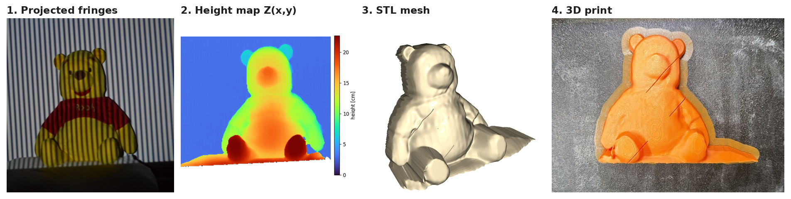
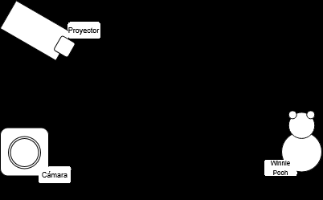
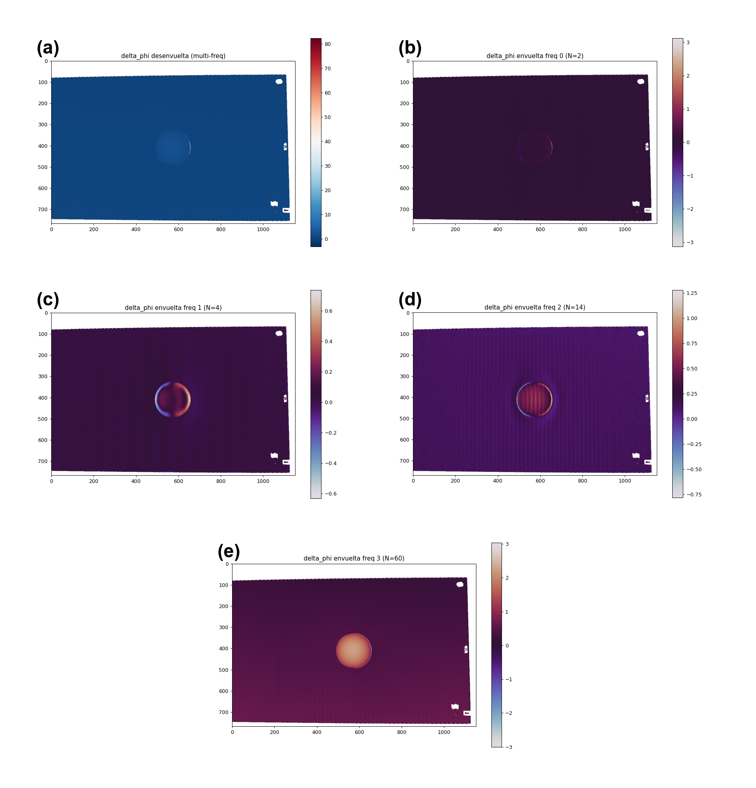
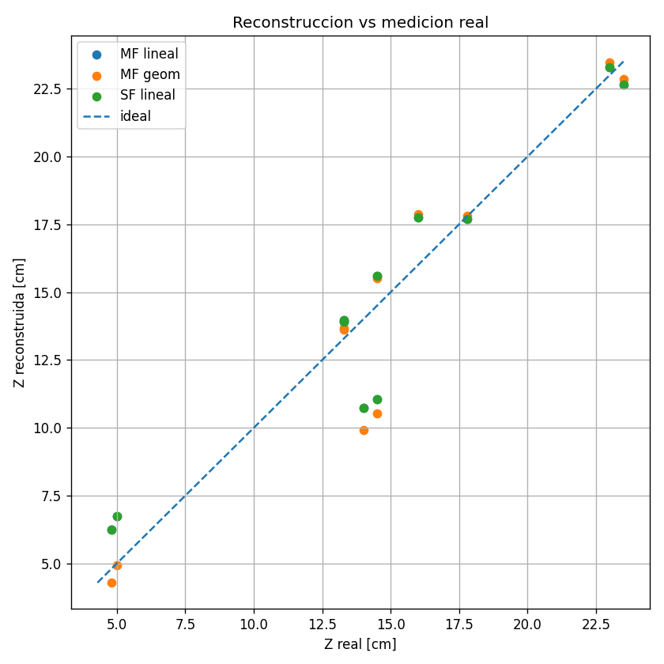

# 3D Reconstruction by Fringe Projection & Phase Shifting

Structured-light 3D scanner built from a consumer camera and a mini projector. Sinusoidal fringe patterns are projected onto an object, the phase of the deformed fringes is recovered with a **4-step phase-shifting** algorithm, unwrapped with **multi-frequency temporal unwrapping**, converted to height by **triangulation**, and exported as a **3D-printable STL**.



> Optics course project (ITESM Monterrey, 2026) — Hector Enrique Campbell Salas & José Feliciano Gutiérrez Rubio.
> Full report (Spanish): [`docs/Reporte_Final_fringe_projection_ES.pdf`](docs/Reporte_Final_fringe_projection_ES.pdf)

## Results at a glance

| Metric | Value |
|---|---|
| Valid pixels after modulation mask | **69.2 %** |
| Fringe frequencies (measured by FFT) | 2, 4, 18, 70 fringes across the field |
| Reconstructed object height | ~13 cm |
| Height error vs. 11 tape-measured landmarks | **RMSE 1.75 cm**, MAE 1.39 cm |
| Leave-one-out RMSE (honest out-of-sample) | 2.09 cm |
| Mono- vs multi-frequency difference (validation sphere) | up to ~0.4 rad (~7 mm) at the center |

The largest errors sit exactly where the physics predicts them: red regions (shirt) absorb the projected light and kill fringe modulation, and the steep sides of the object sit in projector shadows.

## How it works



Camera (Canon M50 Mark II) and projector sit side by side, **L = 1450 mm** from a white reference board, with a baseline **d**. For each frequency, four patterns shifted by 0, π/2, π, 3π/2 are captured on the reference board and on the object.

1. **N-step phase shifting** — for $I_k = A + B\cos(\varphi + \delta_k)$, $\delta_k = 2\pi k/N$:
   $\varphi = \operatorname{atan2}\!\left(-\sum I_k \sin\delta_k,\ \sum I_k\cos\delta_k\right)$, $B = \tfrac{2}{N}\sqrt{C^2+S^2}$
2. **Modulation mask** — keep pixels with $B > \alpha \max B$ (drops shadows, saturation, dark/red regions).
3. **Object − reference** wrapped phase difference at each frequency.
4. **Multi-frequency temporal unwrapping** — the low frequency (no 2π jumps) guides the fringe order of the next one:
   $k_m = \operatorname{round}\!\left[\left(\tfrac{N_m}{N_{m-1}}\Phi_{m-1} - \varphi_m\right)/2\pi\right]$, $\Phi_m = \varphi_m + 2\pi k_m$
5. **Phase → height** — linear triangulation $h = K\,\Delta\varphi$, with $K = L p / (2\pi d) \approx 17.9$ mm/rad for the 70-fringe pattern.
6. **Meshing** — each 2×2 block of valid pixels becomes two triangles → STL (Open3D), smoothed and printed.

## Validation: sphere first

A polystyrene hemisphere was reconstructed with single-frequency spatial unwrapping and with multi-frequency temporal unwrapping. Multi-frequency recovered more detail at the center, so it was used for the complex object.



## Error analysis

11 landmarks (feet, hands, ears, eyes, nose, belly, shirt) were measured with a tape measure (±0.1 cm) and compared against the reconstruction (`src/error.py`), including leave-one-out validation of the phase→cm calibration.



## What didn't work (and what I'd do next)

I also captured the object from several angles (3 × 120° and 12 × 30°) and tried to fuse the views with ICP. Without a calibrated turntable the views don't share a known rotation axis, so the point clouds never registered cleanly, and the final model uses the frontal view only. Next steps:

- calibrated rotary stage or fiducial markers for multi-view registration,
- full triangulation equation instead of the linear approximation,
- camera/projector calibration (intrinsics + gamma) to reduce systematic phase error.

## Repository layout

```
src/
  phase_shifting.py      core library: N-step phase, mask, multi-freq unwrap, phase→height
  SuperficieSTL.py       heightmap → triangle mesh → STL (Open3D)
  process_pooh.py        main pipeline on the plush toy (front view)
  generate_pooh_stl.py   calibrated height map → printable STL
  error.py               landmark-based error analysis (MAE/RMSE, LOO, Monte Carlo)
  sphere_multifreq.py    validation: multi-frequency on the hemisphere
  sphere_singlefreq.py   validation: single-frequency on the hemisphere
  compare_methods.py     mono- vs multi-frequency comparison
  measure_freqs.py       measures real fringe counts via FFT
  demo_synthetic.py      self-contained synthetic demo (no photos needed)
data/
  pooh_front/            32 photos: 4 freq × 4 shifts, object + reference (downscaled)
  sphere/                32 photos: same protocol on the hemisphere (downscaled)
results/                 figures, STL, error tables
docs/                    report (Spanish) and README images
```

## Run it

```bash
pip install -r requirements.txt
python src/process_pooh.py        # phase maps, mask, unwrapped phase -> results/pooh/
python src/generate_pooh_stl.py   # -> results/pooh/pooh.stl
python src/error.py               # error analysis (reuses saved landmark picks)
python src/sphere_multifreq.py    # validation on the hemisphere
```

Run from the repository root. Photos in `data/` are downscaled copies of the originals (Canon M50, 4608×3072); the full-resolution captures are available on request.

## Stack

Python · NumPy · SciPy · scikit-image · Pillow · Matplotlib · Open3D · SolidWorks (mesh cleanup) · FDM 3D printing

## References

1. R. Juarez-Salazar, S. Esquivel-Hernandez, V. H. Diaz-Ramirez, "Optical Fringe Projection: A Straightforward Approach to 3D Metrology," *Metrology* 5, 47 (2025).
2. K. J. Gåsvik, *Optical Metrology*, 3rd ed., Wiley (2002).
3. E. Hecht, *Optics*, 5th ed., Pearson (2017).
